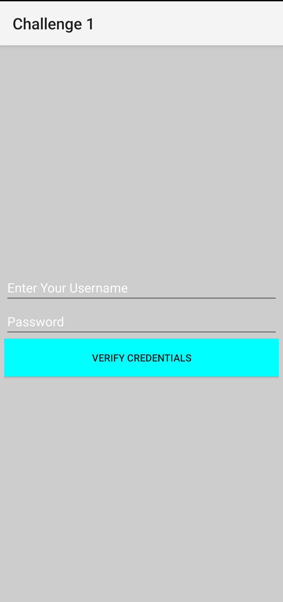

# 🔐 CrackMe – Android Reverse Engineering Challenge

Welcome to the **CrackMe APK Challenge** – designed for cybersecurity students and reverse engineering enthusiasts!

## 🎯 Challenge Objective

Your task is to reverse engineer this Android APK and **find the valid username and password** hidden within. The app works offline and does not connect to any server. All validation is done locally.

---

## 📱 APK Details

- App Type: Login screen with username & password check.
- Functionality: Local validation only (no internet).
- Difficulty: 🟠 Intermediate
- Target Audience: Cybersecurity students, CTF players, RE learners.

---

## 📥 Download the APK

👉 [Download CrackMe.apk](./CrackMe.apk)

> You can install it on an emulator or real Android device.

---
## 📸 Screenshot

  

---

## 📜 License

MIT License 

---

**Happy Hacking! 🔍 Show us your reverse engineering skills!**

#AndroidSecurity #ReverseEngineering #CrackMe #CyberSecurity #CTF #Infosec
